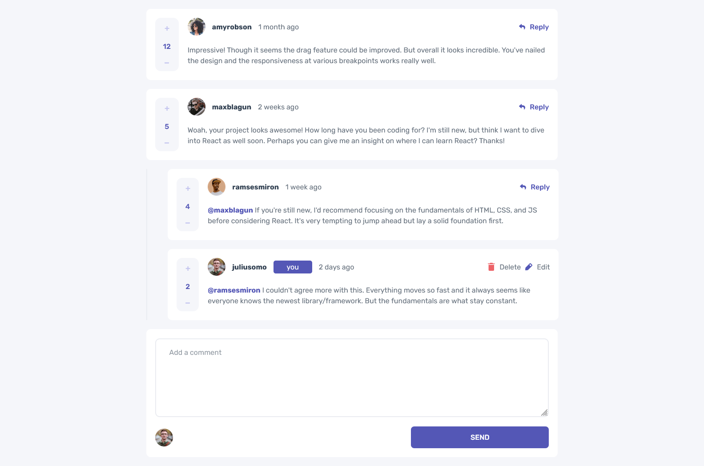

# 💬 Frontend Mentor - Interactive Comments Section Solution

This is a solution to the [Interactive Comments Section Challenge](https://www.frontendmentor.io/challenges/interactive-comments-section-iG1RugEG9) on **Frontend Mentor**.
Frontend Mentor challenges help developers improve their coding skills by building realistic, production-style projects.

---

## 🧭 Table of Contents
- [Overview](#overview)
  - [Screenshot](#screenshot)
  - [Links](#links)
- [My Process](#my-process)
  - [Built With](#built-with)
  - [Useful Resources](#useful-resources)
- [Author](#author)

---

## 📖 Overview
This is a **React + Vite** project designed to replicate an interactive comments section.
The goal was to create a clean, responsive, and dynamic comments UI with features similar to real-world comment systems.

---

### 🖼️ Screenshot

---

### 🔗 Links
- **Live Site:** [https://interactive-comments-section-ten-nu.vercel.app](https://interactive-comments-section-ten-nu.vercel.app)

---

## 🧩 My Process
The development process was straightforward and iterative:
1. **Component Structure** – Broke down the UI into reusable React components.
2. **Styling** – Used **CSS Flexbox** and a **mobile-first** approach for responsive design.
3. **Responsiveness** – Added **media queries** to optimize the layout for desktop screens.
4. **Testing** – Wrote **unit and integration tests** to ensure component stability and interaction accuracy.

---

### ⚙️ Built With
- ⚛️ **React (Vite)**
- 🧱 **Semantic HTML5 / JSX**
- 🎨 **CSS custom properties**
- 🧭 **Flexbox layout**
- 🖥️ **Media queries**

---

### 📚 Useful Resources
- [W3Schools](https://www.w3schools.com/) – General CSS and Flexbox references
- [MDN Web Docs](https://developer.mozilla.org/) – In-depth documentation for web APIs and standards

---

## 👤 Author
**Tonye Hugo Onuoha**
📧 [tonyeonuoha@gmail.com](mailto:tonyeonuoha@gmail.com)

---

